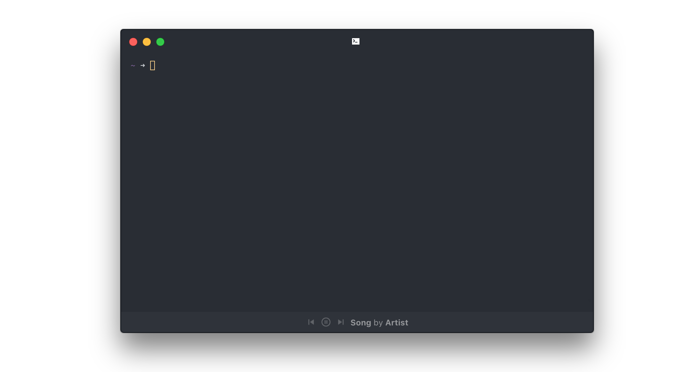

# hyper-spotify [](https://www.npmjs.com/package/hyper-spotify)

[](LICENSE.md)
[](https://standardjs.com)
[](https://github.com/zeit/hyper/releases/tag/1.3.3)
[](https://www.npmjs.com/package/hyper-spotify)

[](https://travis-ci.org/panz3r/hyper-spotify)
[](https://github.com/panz3r/hyper-spotify/issues)

> Spotify plugin for [Hyper](https://hyper.is). <br>
Display currently playing song on [Spotify](https://www.spotify.com) at the bottom of the terminal and allows you to control your favourite music



## Installation
Simply add this plugin inside `~/.hyper.js` and enjoy your music :musical_note:
```js
module.exports = {
  ...
  plugins: ['hyper-spotify']
  ...
}
```

## Configuration
In your `~/.hyper.js` you can define the following parameters to customize `hyper-spotify` appearance
```js
modules.exports = {
  config: {
    ...
    hyperSpotify: {
      position: 'top', // or 'bottom'
      controlsPosition: 'default', // or 'left' or 'right'
    },
    ...
  },
  ... 
};
```

### Position
`hyper-spotify bar` supports 2 different positioning: 
- `top`
- `bottom` (default)

### Controls position
`hyper-spotify controls` support 3 different positioning: 
- `default`, controls appears just before the song details
- `left`, controls are fixed to the left side of Hyper window
- `right`, controls are fixed to the right side of Hyper window


## Limitations
Currently works only on `macOS` and `Linux` (Tested on Ubuntu 17.04)

## Troubleshooting

### Can't load `hyper-spotify`
Unfortunately this seems to be a common issue with `Hyper` plugins (see here [zeit/hyper#191](https://github.com/zeit/hyper/issues/191))

After installing `hyper-spotify` if `Hyper` complains about an error while enabling the plugin:
- do a full restart of `Hyper` app

if even after restaring the issue persists try running the following command
```bash
$ cd ~/.hyper_plugins && npm install
```

## Credits

This plugin is inspired by [`atom-spotify2`](https://github.com/albertorestifo/atom-spotify2) and relies on 
- [`spotify-node-applescript`](https://github.com/andrehaveman/spotify-node-applescript) on macOS
- [`node-dbus`](https://github.com/sidorares/node-dbus) on Linux

to interact with [Spotify](https://www.spotify.com) client